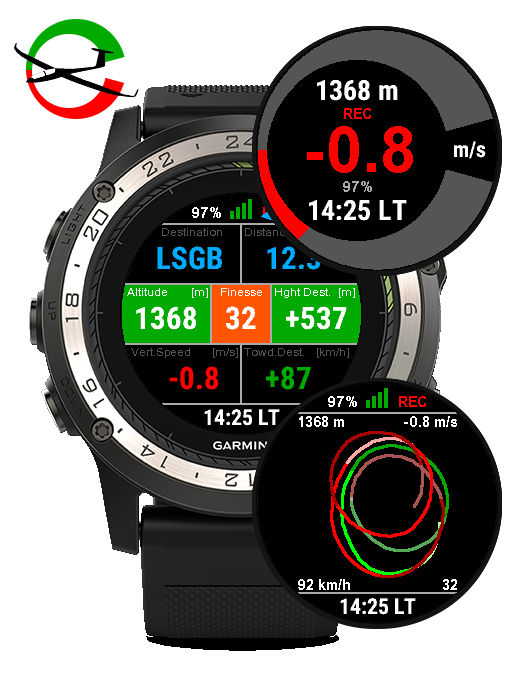

GliderSK (Garmin ConnectIQ) App
===============================
The Glider Swiss Knife for Garmin ConnectIQ devices

   

GliderSK - shortname for Glider Swiss Knife - is a Garmin ConnectIQ Application
that features:
 - a Global view, displaying all flight data in a single pane: altitude,
   ground and vertical speeds, finesse, heading, rate-of-turn and G-meter
 - a Safety view, that tracks your current distance and altitude in respect
   with your chosen target destination and alerts you when your altitude
   becomes too low (or distance too high) to reach that destination given
   your glide ratio, aka. "finesse"
 - a Rate-of-Turn view
 - a Variometer view, including variable-frequency tones to "sound" your
   ascent rate
 - a Varioplot view, allowing to keep track of your ascent/descent rate
   along your flight path
 - a Timers view, allowing to keep track of time since the activity, its
   recording and the last lap were started

Build, Installation and Usage
-----------------------------

Please refer to the INSTALL and USAGE files.

